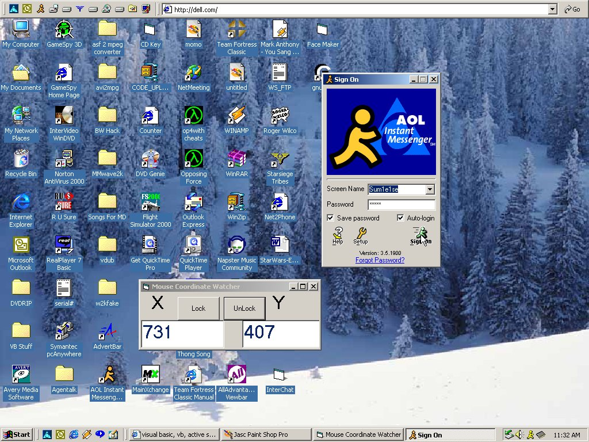



## Mouse Finder

### Description

Locate Your Mouse (X,Y) coordinates

----

Good if you need to pinpoint a spot to make a mouse moving program

----

lets you lock coordinates

Very Useful for macro applications
 
### More Info
 
Works With ANY Resolution

             |
---                |---
**Submitted On**   |2000-04-14 16:12:44
**By**             |[Sum1Else](https://github.com/Planet-Source-Code/PSCIndex/blob/master/ByAuthor/sum1else.md)
**Level**          |Advanced
**User Rating**    |5.0 (15 globes from 3 users)
**Compatibility**  |VB 5\.0, VB 6\.0
**Category**       |[Data Structures](https://github.com/Planet-Source-Code/PSCIndex/blob/master/ByCategory/data-structures__1-33.md)
**World**          |[Visual Basic](https://github.com/Planet-Source-Code/PSCIndex/blob/master/ByWorld/visual-basic.md)
**Archive File**   |[CODE\_UPLOAD48344152000\.zip](https://github.com/Planet-Source-Code/sum1else-mouse-finder__1-7307/archive/master.zip)

